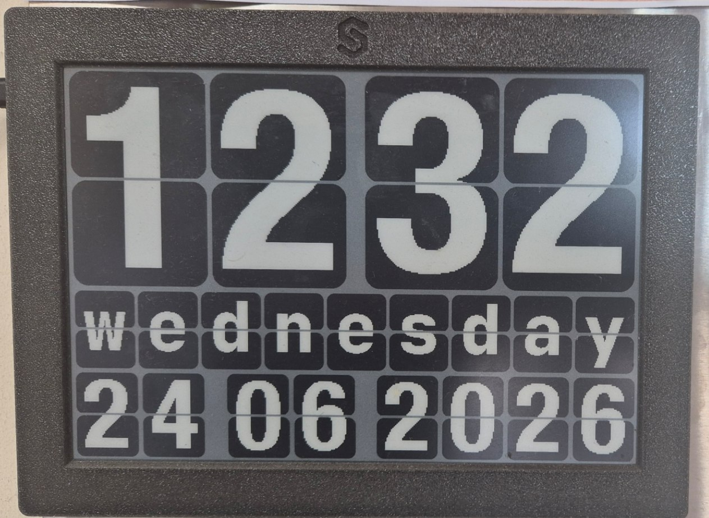

<div align="center">

# 🕰️ Inkplate 10 — E-Paper Wall Clock

**A battery-friendly wall clock on a 9.7" e-paper panel.** Shows time + date during working hours,
a custom logo overnight, and sleeps at **zero power** the rest of the time. No NTP, no hard-coded
WiFi — set everything from your phone's browser.




</div>

---

## Why it's different

Most e-paper clocks either drain their battery keeping WiFi alive, or need an internet/NTP
connection to know the time. This one does neither:

- **WiFi is off almost always.** It only opens a setup access point for ~2 minutes on power-on, then
  shuts WiFi down completely.
- **No NTP.** The RTC is set straight from your browser's clock during setup.
- **Zero-power display.** E-paper holds the last image with no power, so outside working hours the
  device deep-sleeps and the screen still shows your logo.

---

## Features

- **Time + date clock**, refreshed once per minute from the on-board RTC.
- **Configurable working hours** (default `08:00`–`23:00`), stored in flash (NVS) — survives reboots
  and power loss.
- **WiFi setup portal on power-on** (AP + web page) for ~2 minutes, then WiFi off to save battery.
- **Browser time sync** — no NTP/internet needed.
- **Sleep logo** — outside working hours a custom logo is shown while the device deep-sleeps.
- **Swappable logo** — drop in any image and regenerate (see below).
- **Button wake** — the physical button (GPIO36) also wakes the device.

---

## How it works

### On power-on / reset
1. The panel shows the **WiFi setup screen** (logo + instructions).
2. The device starts an access point — **SSID:** `Inkplate-Clock`, **Password:** `clock1234`.
3. Connect a phone/laptop and open **`http://192.168.4.1`** to:
   - set **Work start** / **Work end** hours → *Save work time* (persisted to NVS);
   - tap **Synchronize time with this browser** → sets the RTC from your browser clock.
4. After ~2 minutes the access point and WiFi shut off and the clock takes over.

### Normal running
- From `workStart:00` to `workEnd:00` the clock shows time + date, updating every minute.
- From `workEnd:01` the logo is shown and the device **deep-sleeps** until `workStart`, then resumes.
- The setup AP only opens on a real power-on/reset — **not** on the scheduled morning wake — so it
  doesn't waste battery every day.

> After a full power loss the RTC may lose time — open the setup portal and tap *Synchronize* once.

---

## Hardware

| Part | Notes |
|------|-------|
| [Soldered Inkplate 10](https://soldered.com/products/inkplate-10) | 9.7", 1200×825, 3-bit grayscale e-paper, ESP32-based |
| Battery (optional) | the low-power design is built for long battery life |
| Button on GPIO36 | manual wake |

---

## Project layout

```
Inkplate_10/
├─ platformio.ini        # Inkplate library pinned to 6.0.0
├─ src/
│  ├─ main.cpp           # boot flow, clock loop, sleep logo
│  ├─ portal.h           # WiFi AP + web config page + browser time sync
│  ├─ auxilary.h         # showTime() clock layout + timeToSleep()
│  ├─ display.h          # Inkplate object + fonts
│  ├─ logo.h             # generated 3-bit grayscale logo bitmap
│  └─ Fonts/             # only the fonts the clock uses
└─ tools/
   ├─ gen_logo.py        # regenerate src/logo.h from logo_src.jpg
   └─ logo_src.jpg       # source logo image
```

---

## Configuration

| Setting | Where |
| --- | --- |
| AP SSID / password | `AP_SSID` / `AP_PASS` in `src/portal.h` |
| Setup window length | `PORTAL_DURATION_MS` in `src/portal.h` (currently 2 min) |
| Default working hours | defaults in `src/portal.h` / set via the web page |
| Logo image | `tools/logo_src.jpg` |

---

## Build & flash

Requires [PlatformIO](https://platformio.org/).

```bash
pio run                                   # build
pio run --target upload --upload-port COMx   # flash (replace COMx)
```

On Windows the board may need manual boot mode: hold the **GPIO0 / PROG** button while the uploader
prints `Connecting...`, then release.

> **Note:** the Inkplate Arduino library is pinned to `6.0.0` in `platformio.ini`. Newer versions
> changed the drawing/RTC API and won't compile this code.

---

## Regenerating the logo

Replace `tools/logo_src.jpg` and run:

```bash
python tools/gen_logo.py     # writes src/logo.h (1200×600, 3-bit grayscale); needs Pillow
```

---

## Author

Built by **Andrii Sukhodieiev**.

## License

[MIT](LICENSE)
